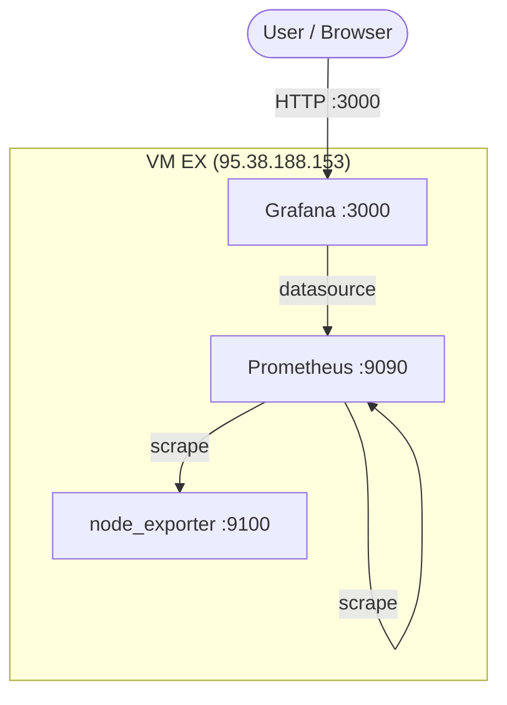

# Scenario 2


## Architecture



- **node_exporter** collects CPU, memory and other system metrics on port 9100.
- **Prometheus** scrapes node_exporter and itself, stores metrics, listens on 9090.
- **Grafana** uses Prometheus as datasource and shows a CPU + Memory dashboard on port 3000.

## Code

### Playbook & Roles

`main.yml` has two plays:

1. **Check SSH connection** – simple ping to make sure the host is reachable.
2. **Deploy monitoring stack** – runs three roles in order:

- `node_exporter`  
  - Installs required packages  
  - Creates prometheus system user  
  - Downloads & extracts node_exporter binary  
  - Creates systemd service and starts it on port 9100

- `prometheus`  
  - Creates directories and user  
  - Downloads & extracts Prometheus  
  - Writes `prometheus.yml` (scrapes itself + node_exporter)  
  - Creates systemd service and starts it on port 9090

- `grafana`  
  - Creates grafana user and directories  
  - Downloads & extracts Grafana  
  - Writes `grafana.ini` (admin/admin, port 3000)  
  - Provisions Prometheus datasource  
  - Provisions a dashboard provider  
  - Adds a ready-made **CPU and Memory** dashboard (JSON)  
  - Creates systemd service and starts Grafana

### Inventory

```yaml
# inventory/inventory/monitoring.yml
monitoring:
  hosts:
    mon-1:
      ansible_host: 95.38.188.153
      ansible_user: root
```

Group vars (`inventory/group_vars/monitoring.yml`):

```yaml
prometheus_port: 9090
grafana_port: 3000
node_exporter_port: 9100
```

## Credentials / Login

```
# Grafana
user: admin
pass: admin
```

URL: http://95.38.188.153:3000

## Challenges
